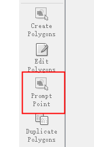

<h1 align="center">
  <br/>ILabelme
</h1>


<h4 align="center">
  Image Polygonal Annotation with Python
</h4>

<div align="center">
  <a href="https://pypi.python.org/pypi/labelme"></a>
  <a href="https://pypi.org/project/labelme"></a>
  <a href="https://github.com/wkentaro/labelme/actions"></a>
</div>

<div align="center">
  <a href="#installation"><b>Installation</b></a> |
  <a href="#usage"><b>Usage</b></a> |
  <a href="https://github.com/wkentaro/labelme/tree/main/examples/tutorial#tutorial-single-image-example"><b>Tutorial</b></a> |
  <a href="https://github.com/wkentaro/labelme/tree/main/examples"><b>Examples</b></a> |
  <a href="https://github.com/wkentaro/labelme/discussions"><b>Discussions</b></a> |
  <a href="https://www.youtube.com/playlist?list=PLI6LvFw0iflh3o33YYnVIfOpaO0hc5Dzw"><b>Youtube FAQ</b></a>
</div>
<br/>

<div align="center">
  
</div>

## Description

Labelme is a graphical image annotation tool inspired by <http://labelme.csail.mit.edu>.  
It is written in Python and uses Qt for its graphical interface.

      
<i>VOC dataset example of instance segmentation.</i>

    
<i>Other examples (semantic segmentation, bbox detection, and classification).</i>

    
<i>Various primitives (polygon, rectangle, circle, line, and point).</i>


## Features

- [x] Image annotation for polygon, rectangle, circle, line and point. ([tutorial](examples/tutorial))
- [x] Image flag annotation for classification and cleaning. ([#166](https://github.com/wkentaro/labelme/pull/166))
- [x] Video annotation. ([video annotation](examples/video_annotation))
- [x] GUI customization (predefined labels / flags, auto-saving, label validation, etc). ([#144](https://github.com/wkentaro/labelme/pull/144))
- [x] Exporting VOC-format dataset for semantic/instance segmentation. ([semantic segmentation](examples/semantic_segmentation), [instance segmentation](examples/instance_segmentation))
- [x] Exporting COCO-format dataset for instance segmentation. ([instance segmentation](examples/instance_segmentation))


## 依赖

- Ubuntu / macOS / Windows
- Python3
- [PyQt5 / PySide2](http://www.riverbankcomputing.co.uk/software/pyqt/intro)


## 安装

There are options:

- Platform agnostic installation: [Anaconda](#anaconda)

### Clone

```bash
git clone https://github.com/QWERDF007/ILabelme.git
```

### Anaconda

You need install [Anaconda](https://www.continuum.io/downloads), then run below:

```bash
# python3
conda create --name=labelme python=3.8
source activate labelme

# 安装依赖
pip install -r pip install -r requirements.txt -f https://download.pytorch.org/whl/torch_stable.html

```


## Usage

```bash
python -m labelme
```

### 智能标注

导入图片后可用

<div align="center">
  
</div>

- 鼠标左键：前景提示点
- 鼠标右键：背景提示点
- 空格：提示完成，选择/创建标签

