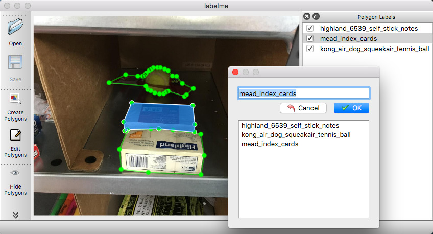

labelme: Image Annotation Tool with Python
==========================================

[](https://pypi.python.org/pypi/labelme)
[](https://travis-ci.org/wkentaro/labelme)
[](https://hub.docker.com/r/wkentaro/labelme)


Labelme is a graphical image annotation tool inspired by <http://labelme.csail.mit.edu>.  
It is written in Python and uses Qt for its graphical interface.


Requirements
------------

- Ubuntu / macOS / Windows
- Python2 / Python3
- [PyQt4 / PyQt5](http://www.riverbankcomputing.co.uk/software/pyqt/intro)


Installation
------------

There are options:

- Platform agonistic installation: Anaconda, Docker
- Platform specific installation: Ubuntu, macOS

**Anaconda**

You need install [Anaconda](https://www.continuum.io/downloads), then run below:

```bash
# python2
conda create --name=labelme python=2.7
source activate labelme
conda install pyqt
pip install labelme

# python3
conda create --name=labelme python=3.6
source activate labelme
# conda install pyqt
pip install pyqt5  # pyqt5 can be installed via pip on python3
pip install labelme
```

**Docker**

You need install [docker](https://www.docker.com), then run below:

```bash
wget https://raw.githubusercontent.com/wkentaro/labelme/master/scripts/labelme_on_docker
chmod u+x labelme_on_docker

# Maybe you need http://sourabhbajaj.com/blog/2017/02/07/gui-applications-docker-mac/ on macOS
./labelme_on_docker static/apc2016_obj3.jpg -O static/apc2016_obj3.json
```

**Ubuntu**

```bash
# Ubuntu 14.04
sudo apt-get install python-qt4 pyqt4-dev-tools
sudo pip install labelme  # python2 works
```

**macOS**

```bash
# macOS Sierra
brew install pyqt  # maybe pyqt5
pip install labelme  # both python2/3 should work
```


Usage
-----

### Annotation

Run `labelme --help` for detail.

```bash
labelme  # Open GUI
labelme tutorial/apc2016_obj3.jpg  # Specify file
labelme tutorial/apc2016_obj3.jpg --nodata  # Not include image data but relative image path in JSON file
labelme tutorial/apc2016_obj3.jpg -O tutorial/apc2016_obj3.json  # Close window after the save
```



The annotations are saved as a [JSON](http://www.json.org/) file. The
file includes the image itself.

### Visualization

To view the json file quickly, you can use utility script:

```bash
labelme_draw_json tutorial/apc2016_obj3.json
```


### Convert to Dataset

To convert the json to set of image and label, you can run following:


```bash
labelme_json_to_dataset tutorial/apc2016_obj3.json -o tutorial/apc2016_obj3_json
```

It generates standard files from the JSON file.

- [img.png](tutorial/apc2016_obj3_json/img.png): Image file.
- [label.png](tutorial/apc2016_obj3_json/label.png): Int32 label file.
- [label_viz.png](tutorial/apc2016_obj3_json/label_viz.png): Visualization of `label.png`.
- [label_names.txt](tutorial/apc2016_obj3_json/label_names.txt): Label names for values in `label.png`.

Note that loading `label.png` is a bit difficult
(`scipy.misc.imread`, `skimage.io.imread` may not work correctly),
and please use `PIL.Image.open` to avoid unexpected behavior:

```python
# see tutorial/load_label_png.py also.
>>> import numpy as np
>>> import PIL.Image

>>> label_png = 'tutorial/apc2016_obj3_json/label.png'
>>> lbl = np.asarray(PIL.Image.open(label_png))
>>> print(lbl.dtype)
dtype('int32')
>>> np.unique(lbl)
array([0, 1, 2, 3], dtype=int32)
>>> lbl.shape
(907, 1210)
```


Screencast
----------


Acknowledgement
---------------

This repo is the fork of [mpitid/pylabelme](https://github.com/mpitid/pylabelme),
whose development has already stopped.
