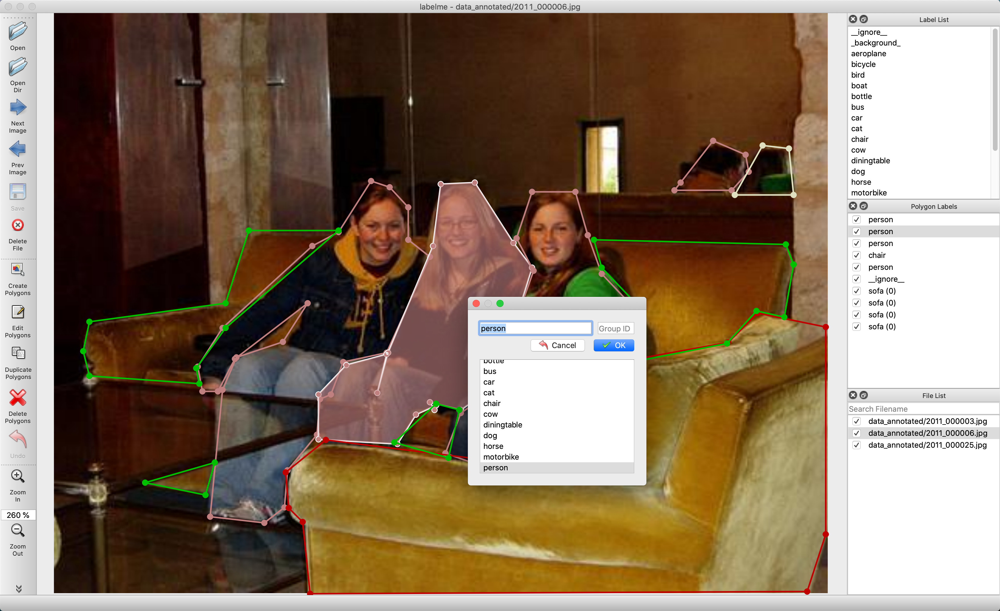
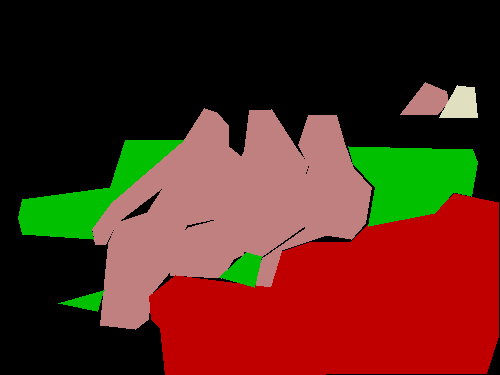
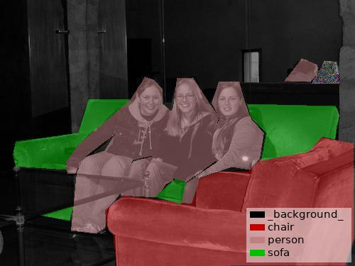
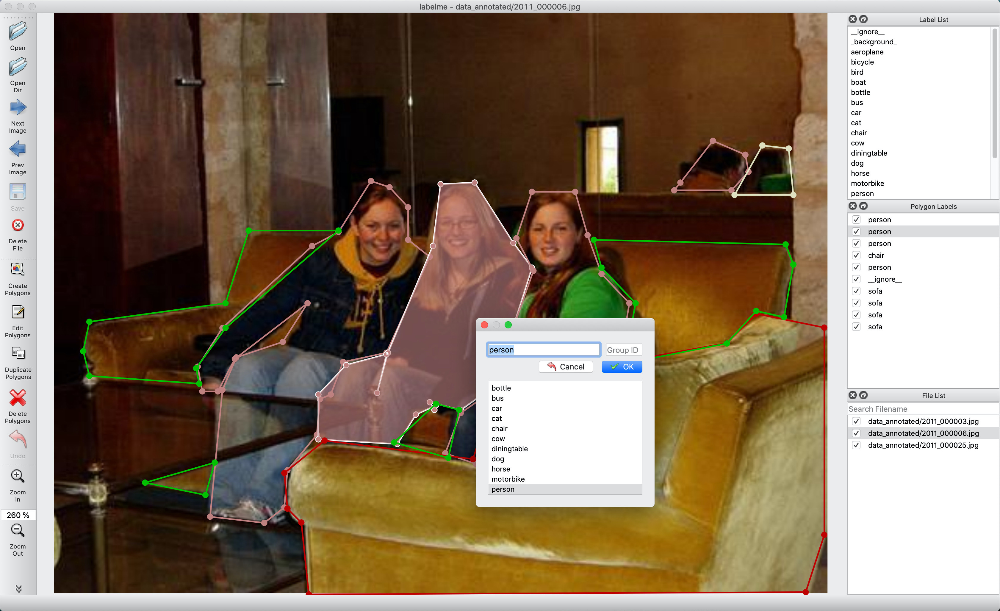
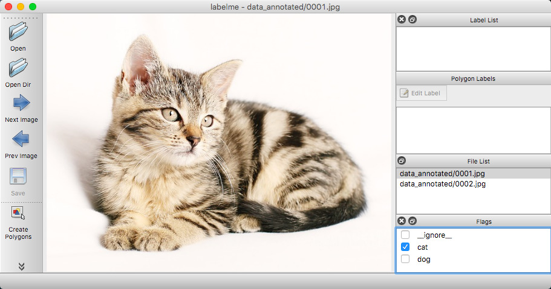

<h1 align="center">
  <br/>labelme
</h1>

<h4 align="center">
  Image Polygonal Annotation with Python
</h4>

<div align="center">
  <a href="https://pypi.python.org/pypi/labelme"></a>
  <!-- <a href="https://pypi.org/project/labelme"></a> -->
  <a href="https://github.com/wkentaro/labelme/actions"></a>
  <a href="https://discord.com/invite/uAjxGcJm83"></a>
</div>

<div align="center">
  <a href="#installation"><b>Installation</b></a>
  | <a href="#usage"><b>Usage</b></a>
  | <a href="#examples"><b>Examples</b></a>
  <!-- | <a href="https://github.com/wkentaro/labelme/discussions"><b>Community</b></a> -->
  <!-- | <a href="https://www.youtube.com/playlist?list=PLI6LvFw0iflh3o33YYnVIfOpaO0hc5Dzw"><b>Youtube FAQ</b></a> -->
</div>

<br/>

<div align="center">
  
</div>

## Description

Labelme is a graphical image annotation tool inspired by <http://labelme.csail.mit.edu>.  
It is written in Python and uses Qt for its graphical interface.

      
<i>VOC dataset example of instance segmentation.</i>

    
<i>Other examples (semantic segmentation, bbox detection, and classification).</i>

    
<i>Various primitives (polygon, rectangle, circle, line, and point).</i>


## Features

- [x] Image annotation for polygon, rectangle, circle, line and point. ([tutorial](examples/tutorial))
- [x] Image flag annotation for classification and cleaning. ([#166](https://github.com/wkentaro/labelme/pull/166))
- [x] Video annotation. ([video annotation](examples/video_annotation))
- [x] GUI customization (predefined labels / flags, auto-saving, label validation, etc). ([#144](https://github.com/wkentaro/labelme/pull/144))
- [x] Exporting VOC-format dataset for semantic/instance segmentation. ([semantic segmentation](examples/semantic_segmentation), [instance segmentation](examples/instance_segmentation))
- [x] Exporting COCO-format dataset for instance segmentation. ([instance segmentation](examples/instance_segmentation))


## Installation

There are 3 options to install labelme:

### Option 1: Using pip

For more detail, check ["Install Labelme using Terminal"](https://www.labelme.io/docs/install-labelme-terminal)

```bash
pip install labelme

# To install the latest version from GitHub:
# pip install git+https://github.com/wkentaro/labelme.git
```

### Option 2: Using standalone executable (Easiest)

If you're willing to invest in the convenience of simple installation without any dependencies (Python, Qt),
you can download the standalone executable from ["Install Labelme as App"](https://www.labelme.io/docs/install-labelme-app).

It's a one-time payment for lifetime access, and it helps us to maintain this project.

### Option 3: Using a package manager in each Linux distribution

In some Linux distributions, you can install labelme via their package managers (e.g., apt, pacman). The following systems are currently available:

[](https://repology.org/project/labelme/versions)

## Usage

Run `labelme --help` for detail.  
The annotations are saved as a [JSON](http://www.json.org/) file.

```bash
labelme  # just open gui

# tutorial (single image example)
cd examples/tutorial
labelme apc2016_obj3.jpg  # specify image file
labelme apc2016_obj3.jpg -O apc2016_obj3.json  # close window after the save
labelme apc2016_obj3.jpg --nodata  # not include image data but relative image path in JSON file
labelme apc2016_obj3.jpg \
  --labels highland_6539_self_stick_notes,mead_index_cards,kong_air_dog_squeakair_tennis_ball  # specify label list

# semantic segmentation example
cd examples/semantic_segmentation
labelme data_annotated/  # Open directory to annotate all images in it
labelme data_annotated/ --labels labels.txt  # specify label list with a file
```

### Command Line Arguments
- `--output` specifies the location that annotations will be written to. If the location ends with .json, a single annotation will be written to this file. Only one image can be annotated if a location is specified with .json. If the location does not end with .json, the program will assume it is a directory. Annotations will be stored in this directory with a name that corresponds to the image that the annotation was made on.
- The first time you run labelme, it will create a config file in `~/.labelmerc`. You can edit this file and the changes will be applied the next time that you launch labelme. If you would prefer to use a config file from another location, you can specify this file with the `--config` flag.
- Without the `--nosortlabels` flag, the program will list labels in alphabetical order. When the program is run with this flag, it will display labels in the order that they are provided.
- Flags are assigned to an entire image. [Example](examples/classification)
- Labels are assigned to a single polygon. [Example](examples/bbox_detection)

### FAQ

- **How to convert JSON file to numpy array?** See [examples/tutorial](examples/tutorial#convert-to-dataset).
- **How to load label PNG file?** See [examples/tutorial](examples/tutorial#how-to-load-label-png-file).
- **How to get annotations for semantic segmentation?** See [examples/semantic_segmentation](examples/semantic_segmentation).
- **How to get annotations for instance segmentation?** See [examples/instance_segmentation](examples/instance_segmentation).


## Examples

* [Image Classification](examples/classification)
* [Bounding Box Detection](examples/bbox_detection)
* [Semantic Segmentation](examples/semantic_segmentation)
* [Instance Segmentation](examples/instance_segmentation)
* [Video Annotation](examples/video_annotation)


## How to build standalone executable

```bash
LABELME_PATH=./labelme
OSAM_PATH=$(python -c 'import os, osam; print(os.path.dirname(osam.__file__))')
pyinstaller labelme/labelme/__main__.py \
  --name=Labelme \
  --windowed \
  --noconfirm \
  --specpath=build \
  --add-data=$(OSAM_PATH)/_models/yoloworld/clip/bpe_simple_vocab_16e6.txt.gz:osam/_models/yoloworld/clip \
  --add-data=$(LABELME_PATH)/config/default_config.yaml:labelme/config \
  --add-data=$(LABELME_PATH)/icons/*:labelme/icons \
  --add-data=$(LABELME_PATH)/translate/*:translate \
  --icon=$(LABELME_PATH)/icons/icon.png \
  --onedir
```


## Acknowledgement

This repo is the fork of [mpitid/pylabelme](https://github.com/mpitid/pylabelme).
