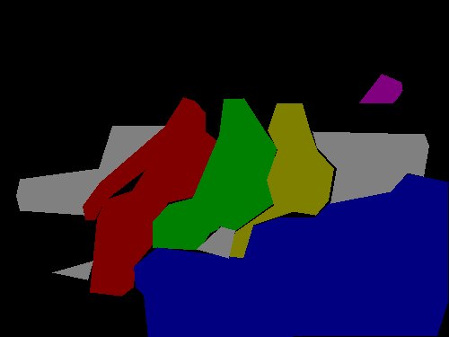

<h1 align="center">
  <br/>labelme
</h1>

<h4 align="center">
  Image Polygonal Annotation with Python
</h4>

<div align="center">
  <a href="https://pypi.python.org/pypi/labelme"></a>
  <a href="https://pypi.org/project/labelme"></a>
  <a href="https://github.com/wkentaro/labelme/actions"></a>
</div>

<div align="center">
  <a href="#installation"><b>Installation</b></a> |
  <a href="#usage"><b>Usage</b></a> |
  <a href="https://github.com/wkentaro/labelme/tree/main/examples/tutorial#tutorial-single-image-example"><b>Tutorial</b></a> |
  <a href="https://github.com/wkentaro/labelme/tree/main/examples"><b>Examples</b></a> |
  <a href="https://github.com/wkentaro/labelme/discussions"><b>Discussions</b></a> |
  <a href="https://www.youtube.com/playlist?list=PLI6LvFw0iflh3o33YYnVIfOpaO0hc5Dzw"><b>Youtube FAQ</b></a>
</div>

<br/>

<div align="center">
  
</div>

## Description

Labelme is a graphical image annotation tool inspired by <http://labelme.csail.mit.edu>.  
It is written in Python and uses Qt for its graphical interface.

      
<i>VOC dataset example of instance segmentation.</i>

    
<i>Other examples (semantic segmentation, bbox detection, and classification).</i>

    
<i>Various primitives (polygon, rectangle, circle, line, and point).</i>


## Features

- [x] Image annotation for polygon, rectangle, circle, line and point. ([tutorial](examples/tutorial))
- [x] Image flag annotation for classification and cleaning. ([#166](https://github.com/wkentaro/labelme/pull/166))
- [x] Video annotation. ([video annotation](examples/video_annotation))
- [x] GUI customization (predefined labels / flags, auto-saving, label validation, etc). ([#144](https://github.com/wkentaro/labelme/pull/144))
- [x] Exporting VOC-format dataset for semantic/instance segmentation. ([semantic segmentation](examples/semantic_segmentation), [instance segmentation](examples/instance_segmentation))
- [x] Exporting COCO-format dataset for instance segmentation. ([instance segmentation](examples/instance_segmentation))


## Requirements

- Ubuntu / macOS / Windows
- Python3
- [PyQt5 / PySide2](http://www.riverbankcomputing.co.uk/software/pyqt/intro)


## Installation

There are options:

- Platform agnostic installation: [Anaconda](#anaconda)
- Platform specific installation: [Ubuntu](#ubuntu), [macOS](#macos), [Windows](#windows)
- Pre-build binaries from [the release section](https://github.com/wkentaro/labelme/releases)

### Anaconda

You need install [Anaconda](https://www.continuum.io/downloads), then run below:

```bash
# python3
conda create --name=labelme python=3
source activate labelme
# conda install -c conda-forge pyside2
# conda install pyqt
# pip install pyqt5  # pyqt5 can be installed via pip on python3
pip install labelme
# or you can install everything by conda command
# conda install labelme -c conda-forge
```

### Ubuntu

```bash
sudo apt-get install labelme

# or
sudo pip3 install labelme

# or install standalone executable from:
# https://github.com/wkentaro/labelme/releases
```

### macOS

```bash
brew install pyqt  # maybe pyqt5
pip install labelme

# or
brew install wkentaro/labelme/labelme  # command line interface
# brew install --cask wkentaro/labelme/labelme  # app

# or install standalone executable/app from:
# https://github.com/wkentaro/labelme/releases
```

### Windows

Install [Anaconda](https://www.continuum.io/downloads), then in an Anaconda Prompt run:

```bash
conda create --name=labelme python=3
conda activate labelme
pip install labelme

# or install standalone executable/app from:
# https://github.com/wkentaro/labelme/releases
```


## Usage

Run `labelme --help` for detail.  
The annotations are saved as a [JSON](http://www.json.org/) file.

```bash
labelme  # just open gui

# tutorial (single image example)
cd examples/tutorial
labelme apc2016_obj3.jpg  # specify image file
labelme apc2016_obj3.jpg -O apc2016_obj3.json  # close window after the save
labelme apc2016_obj3.jpg --nodata  # not include image data but relative image path in JSON file
labelme apc2016_obj3.jpg \
  --labels highland_6539_self_stick_notes,mead_index_cards,kong_air_dog_squeakair_tennis_ball  # specify label list

# semantic segmentation example
cd examples/semantic_segmentation
labelme data_annotated/  # Open directory to annotate all images in it
labelme data_annotated/ --labels labels.txt  # specify label list with a file
```

For more advanced usage, please refer to the examples:

* [Tutorial (Single Image Example)](examples/tutorial)
* [Semantic Segmentation Example](examples/semantic_segmentation)
* [Instance Segmentation Example](examples/instance_segmentation)
* [Video Annotation Example](examples/video_annotation)

### Command Line Arguments
- `--output` specifies the location that annotations will be written to. If the location ends with .json, a single annotation will be written to this file. Only one image can be annotated if a location is specified with .json. If the location does not end with .json, the program will assume it is a directory. Annotations will be stored in this directory with a name that corresponds to the image that the annotation was made on.
- The first time you run labelme, it will create a config file in `~/.labelmerc`. You can edit this file and the changes will be applied the next time that you launch labelme. If you would prefer to use a config file from another location, you can specify this file with the `--config` flag.
- Without the `--nosortlabels` flag, the program will list labels in alphabetical order. When the program is run with this flag, it will display labels in the order that they are provided.
- Flags are assigned to an entire image. [Example](examples/classification)
- Labels are assigned to a single polygon. [Example](examples/bbox_detection)

## FAQ

- **How to convert JSON file to numpy array?** See [examples/tutorial](examples/tutorial#convert-to-dataset).
- **How to load label PNG file?** See [examples/tutorial](examples/tutorial#how-to-load-label-png-file).
- **How to get annotations for semantic segmentation?** See [examples/semantic_segmentation](examples/semantic_segmentation).
- **How to get annotations for instance segmentation?** See [examples/instance_segmentation](examples/instance_segmentation).


## Developing

```bash
git clone https://github.com/wkentaro/labelme.git
cd labelme

# Install anaconda3 and labelme
curl -L https://github.com/wkentaro/dotfiles/raw/main/local/bin/install_anaconda3.sh | bash -s .
source .anaconda3/bin/activate
pip install -e .
```


## How to build standalone executable

Below shows how to build the standalone executable on macOS, Linux and Windows.  

```bash
# Setup conda
conda create --name labelme python=3.9
conda activate labelme

# Build the standalone executable
pip install .
pip install 'matplotlib<3.3'
pip install pyinstaller
pyinstaller labelme.spec
dist/labelme --version
```


## How to contribute

Make sure below test passes on your environment.  
See `.github/workflows/ci.yml` for more detail.

```bash
pip install -r requirements-dev.txt

flake8 .
black --line-length 79 --check labelme/
MPLBACKEND='agg' pytest -vsx tests/
```


## Acknowledgement

This repo is the fork of [mpitid/pylabelme](https://github.com/mpitid/pylabelme).
