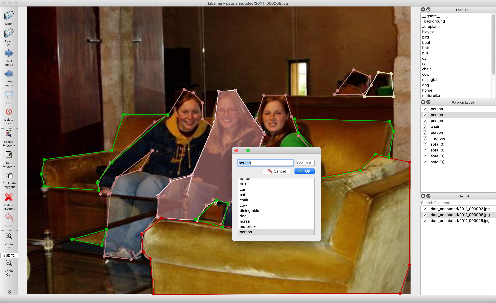
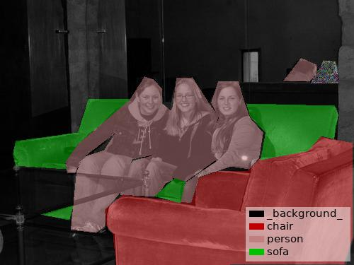
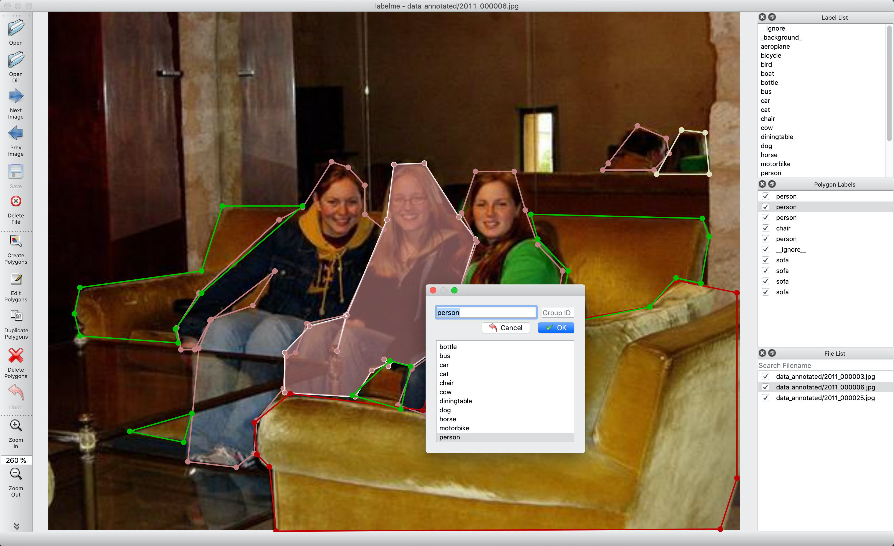
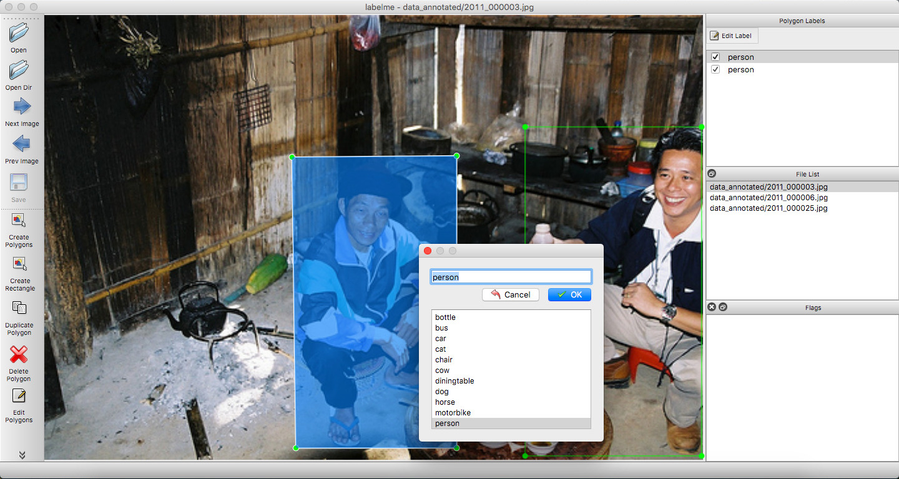
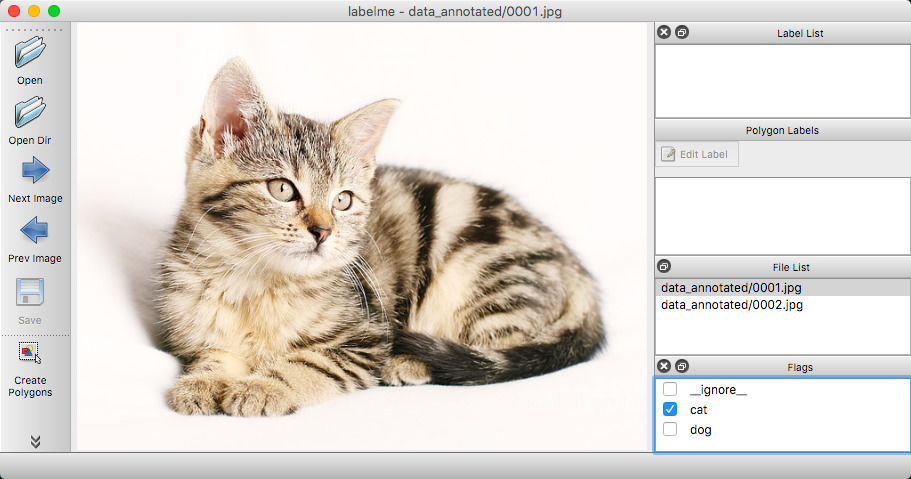

<h1 align="center">
  <br/>labelme
</h1>

<h4 align="center">
  Image annotation with Python.
</h4>

<div align="center">
  <a href="https://pypi.python.org/pypi/labelme"></a>
  <!-- <a href="https://pypi.org/project/labelme"></a> -->
  <a href="https://github.com/wkentaro/labelme/actions"></a>
  <a href="https://discord.com/invite/uAjxGcJm83"></a>
</div>

<div align="center">
  <a href="#installation"><b>Installation</b></a>
  | <a href="#usage"><b>Usage</b></a>
  | <a href="#examples"><b>Examples</b></a>
  | <a href="https://labelme.io"><b>labelme.io ↗</b></a>
  <!-- | <a href="https://github.com/wkentaro/labelme/discussions"><b>Community</b></a> -->
  <!-- | <a href="https://www.youtube.com/playlist?list=PLI6LvFw0iflh3o33YYnVIfOpaO0hc5Dzw"><b>Youtube FAQ</b></a> -->
</div>

<br/>

<div align="center">
  
</div>

## Description

Labelme is a graphical image annotation tool inspired by <http://labelme.csail.mit.edu>.\
It is written in Python and uses Qt for its graphical interface.

> Looking for a simple install without Python or Qt? Get the standalone app at **[labelme.io](https://labelme.io)**.

    \
<i>VOC dataset example of instance segmentation.</i>

  \
<i>Other examples (semantic segmentation, bbox detection, and classification).</i>

  \
<i>Various primitives (polygon, rectangle, circle, line, and point).</i>


<p><i>Multi-language support (English, 中文, 日本語, 한국어, Deutsch, Français, and more).</i></p>

## Features

- [x] Image annotation for polygon, rectangle, circle, line and point ([tutorial](examples/tutorial))
- [x] Image flag annotation for classification and cleaning ([#166](https://github.com/wkentaro/labelme/pull/166))
- [x] Video annotation ([video annotation](examples/video_annotation))
- [x] GUI customization (predefined labels / flags, auto-saving, label validation, etc) ([#144](https://github.com/wkentaro/labelme/pull/144))
- [x] Exporting VOC-format dataset for [semantic segmentation](examples/semantic_segmentation), [instance segmentation](examples/instance_segmentation)
- [x] Exporting COCO-format dataset for [instance segmentation](examples/instance_segmentation)
- [x] AI-assisted point-to-polygon/mask annotation by SAM, EfficientSAM models
- [x] AI text-to-annotation by YOLO-world, SAM3 models

**🌏 Available in 20 languages** - English · 日本語 · 한국어 · 简体中文 · 繁體中文 · Deutsch · Ελληνικά · Français · Español · Italiano · Português · Nederlands · Magyar · Русский · ไทย · Tiếng Việt · Türkçe · Українська · Polski · فارسی (`LANG=ja_JP.UTF-8 labelme`)

## Installation

There are 3 options to install labelme:

### Option 1: Using pip

For more detail, check ["Install Labelme using Terminal"](https://www.labelme.io/docs/install-labelme-terminal)

```bash
pip install labelme

# To install the latest version from GitHub:
# pip install git+https://github.com/wkentaro/labelme.git
```

### Option 2: Using standalone executable (Easiest)

If you're willing to invest in the convenience of simple installation without any dependencies (Python, Qt),
you can download the standalone executable from ["Install Labelme as App"](https://www.labelme.io/docs/install-labelme-app).

It's a one-time payment for lifetime access, and it helps us to maintain this project.

### Option 3: Linux distribution packages

On some Linux distributions, labelme is also packaged in the system's native repository and can be installed with the distribution's standard package tooling. The badge below tracks which distributions currently ship labelme and which version each one provides:

[](https://repology.org/project/labelme/versions)

### Supported Python and platforms

|        | Supported (v7.x)               | Maintenance (v6.3.x) |
| ------ | ------------------------------ | -------------------- |
| Python | 3.11 - 3.14                    | 3.10 - 3.11          |
| Qt     | Qt6 (PySide6)                  | Qt5                  |
| OS     | 64-bit macOS / Windows / Linux | older OSes           |

labelme follows [SPEC 0](https://scientific-python.org/specs/spec-0000/) (the successor to [NEP 29](https://numpy.org/neps/nep-0029-deprecation_policy.html)) for dropping Python versions, in step with its core scientific dependencies (numpy, scipy, scikit-image). v6.3.x is the maintenance line for Qt5 and Python 3.10 stragglers.

v6.3.x receives critical fixes only, on a best-effort basis with no release cadence or SLA. "Critical" is limited to:

- security vulnerabilities,
- data-loss or annotation-corruption bugs,
- install or launch breakage caused by upstream dependency drift.

Feature backports and non-critical bugs are out of scope; all new development happens on v7.x.

### Upgrading from v6.x to v7

v7.0.0 raises the platform floor:

- **Qt binding:** the GUI moved from PyQt5 (Qt5) to PySide6 (Qt6). `pip install labelme` now pulls PySide6 instead of PyQt5.
- **Python:** the minimum is now Python 3.11 (3.10 is dropped).
- **OS:** Qt6 requires a 64-bit macOS, Windows, or Linux; older OSes that only Qt5 supported are no longer covered.
- **No public Python API:** labelme is an application, not a library, and exposes no stable Python API. Its internal modules were privatized in v7 (renamed to underscore-prefixed names), so `import labelme.app`, `labelme.utils`, `labelme.widgets`, and similar imports no longer work. If you previously imported labelme internals, pin `labelme<7` and vendor the code you need; see [`examples/utils.py`](examples/utils.py) for copy-and-adapt reference code that reads the JSON annotation format without depending on labelme.

If you need to stay on PyQt5/Qt5, Python 3.10, or an older OS, pin to the v6.3.x maintenance line:

```bash
pip install 'labelme<7'
```

All previous releases remain installable from [PyPI](https://pypi.org/project/labelme/#history), so existing pins keep working.

v7.0.0 also changes config parsing:

- **Config booleans:** `~/.labelmerc` is now parsed with ruamel.yaml (YAML 1.2), so the boolean spellings `yes`/`no`/`on`/`off` (in any capitalization) are read as strings rather than booleans. If you set any boolean option this way, switch it to `true`/`false`.

### Public interface

labelme is an application. The interfaces you can build on and that we keep stable are:

- the **command-line interface** (`labelme ...`),
- the **on-disk JSON annotation format**, and
- the **`~/.labelmerc` config format**.

Everything else, including the Python import surface, is internal and may change or be renamed without notice. To consume annotations from your own code, read the JSON format directly (see [`examples/utils.py`](examples/utils.py)).

## Usage

Run `labelme --help` for detail.\
The annotations are saved as a [JSON](http://www.json.org/) file.

```bash
labelme  # just open gui

# tutorial (single image example)
cd examples/tutorial
labelme apc2016_obj3.jpg  # specify image file
labelme apc2016_obj3.jpg --output annotations/  # save annotation JSON files to a directory
labelme apc2016_obj3.jpg --with-image-data  # include image data in JSON file
labelme apc2016_obj3.jpg \
  --labels highland_6539_self_stick_notes,mead_index_cards,kong_air_dog_squeakair_tennis_ball  # specify label list

# semantic segmentation example
cd examples/semantic_segmentation
labelme data_annotated/  # Open directory to annotate all images in it
labelme data_annotated/ --labels labels.txt  # specify label list with a file
```

### Command Line Arguments

- `--output` specifies the location that annotations will be written to. If the location ends with .json, a single annotation will be written to this file. Only one image can be annotated if a location is specified with .json. If the location does not end with .json, the program will assume it is a directory. Annotations will be stored in this directory with a name that corresponds to the image that the annotation was made on.
- The first time you run labelme, it will create a config file at `~/.labelmerc`. Add only the settings you want to override. For all available options and their defaults, see [`default_config.yaml`](labelme/_config/default_config.yaml). If you would prefer to use a config file from another location, you can specify this file with the `--config` flag.
- Without the `--no-sort-labels` flag, the program will list labels in alphabetical order. When the program is run with this flag, it will display labels in the order that they are provided.
- Flags are assigned to an entire image. [Example](examples/classification)
- Labels are assigned to a single polygon. [Example](examples/bbox_detection)

### FAQ

- **How to convert JSON file to numpy array?** See [examples/tutorial](examples/tutorial#convert-to-dataset).
- **How to load label PNG file?** See [examples/tutorial](examples/tutorial#how-to-load-label-png-file).
- **How to get annotations for semantic segmentation?** See [examples/semantic_segmentation](examples/semantic_segmentation).
- **How to get annotations for instance segmentation?** See [examples/instance_segmentation](examples/instance_segmentation).

## Examples

- [Image Classification](examples/classification)
- [Bounding Box Detection](examples/bbox_detection)
- [Semantic Segmentation](examples/semantic_segmentation)
- [Instance Segmentation](examples/instance_segmentation)
- [Video Annotation](examples/video_annotation)

## How to build standalone executable

```bash
LABELME_PATH=./labelme
OSAM_PATH=$(python -c 'import os, osam; print(os.path.dirname(osam.__file__))')
pip install 'numpy<2.0'  # numpy>=2.0 causes build errors (see #1532)
pyinstaller labelme/labelme/__main__.py \
  --name=Labelme \
  --windowed \
  --noconfirm \
  --specpath=build \
  --add-data=$(OSAM_PATH)/_models/yoloworld/clip/bpe_simple_vocab_16e6.txt.gz:osam/_models/yoloworld/clip \
  --add-data=$(LABELME_PATH)/_config/default_config.yaml:labelme/_config \
  --add-data=$(LABELME_PATH)/icons/*:labelme/icons \
  --add-data=$(LABELME_PATH)/translate/*:translate \
  --icon=$(LABELME_PATH)/icons/icon-256.png \
  --onedir
```

## Acknowledgement

This repo is the fork of [mpitid/pylabelme](https://github.com/mpitid/pylabelme).
