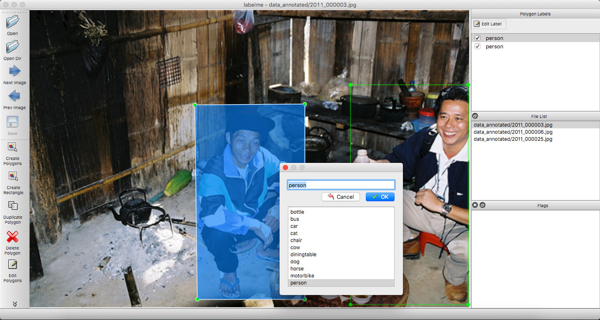

# Bounding Box Detection Example


## Usage

```bash
labelme data_annotated --labels labels.txt --nodata --autosave
```




## Convert to VOC-format Dataset

```bash
# It generates:
#   - data_dataset_voc/JPEGImages
#   - data_dataset_voc/Annotations
#   - data_dataset_voc/AnnotationsVisualization
./labelme2voc.py data_annotated data_dataset_voc --labels labels.txt
```

 

<i>Fig1. JPEG image (left), Bounding box annotation visualization (right).</i>
