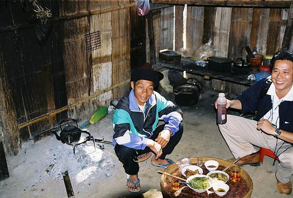
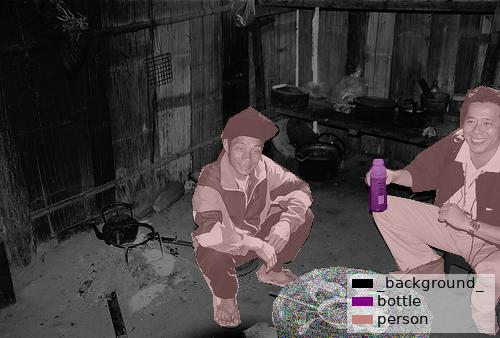
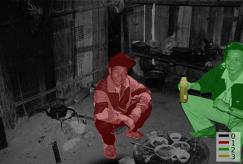

# Instance Segmentation Example

## Annotation

```bash
labelme data_annotated --labels labels.txt --nodata
```


## Convert to VOC-like Dataset

```bash
# It generates:
#   - data_dataset_voc/JPEGImages
#   - data_dataset_voc/SegmentationClass
#   - data_dataset_voc/SegmentationClassVisualization
#   - data_dataset_voc/SegmentationObject
#   - data_dataset_voc/SegmentationObjectVisualization
./labelme2voc.py labels.txt data_annotated data_dataset_voc
```

    
Fig 1. JPEG image (left), JPEG class label visualization (center), JPEG instance label visualization (right)
