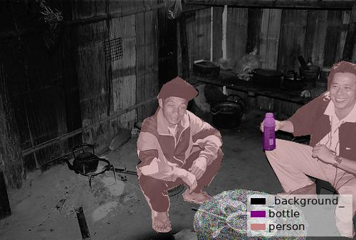

# Semantic Segmentation Example

## Annotation

```bash
labelme data_annotated --labels="$(tr '\n' , < labels.txt)" --nodata
```


## Convert to VOC-like Dataset

```bash
# It generates:
#   - data_dataset_voc/JPEGImages
#   - data_dataset_voc/SegmentationClass
#   - data_dataset_voc/SegmentationClassVisualization
./labelme2voc.py labels.txt data_annotated data_dataset_voc
```

  

Fig 1. JPEG image (left), PNG label (center), JPEG label visualization (right)  
*Note that the reason why the label file is mostly black is it contains only very low label values (ex. `-1, 0, 4, 14`).*
