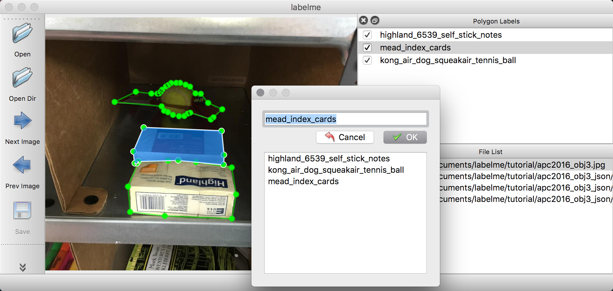
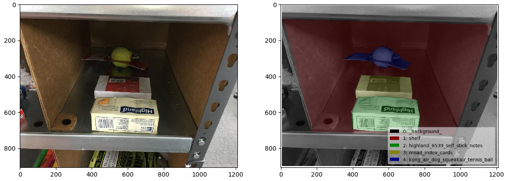
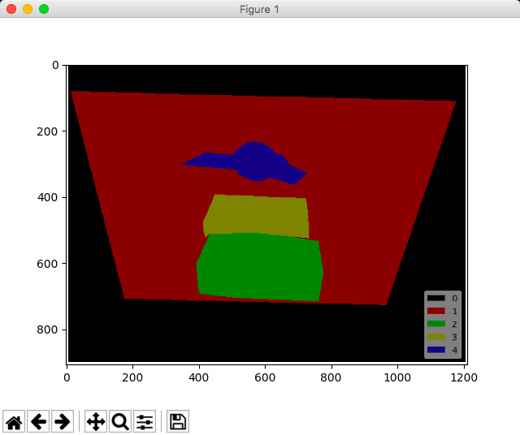

# Tutorial (Single Image Example)

## Annotation

```bash
labelme apc2016_obj3.jpg -O apc2016_obj3.json
```




## Visualization

To view the json file quickly, you can use utility script:

```bash
labelme_draw_json apc2016_obj3.json
```




## Convert to Dataset

To convert the json to set of image and label, you can run following:


```bash
labelme_json_to_dataset apc2016_obj3.json -o apc2016_obj3_json
```

It generates standard files from the JSON file.

- [img.png](apc2016_obj3_json/img.png): Image file.
- [label.png](apc2016_obj3_json/label.png): uint8 label file.
- [label_viz.png](apc2016_obj3_json/label_viz.png): Visualization of `label.png`.
- [label_names.txt](apc2016_obj3_json/label_names.txt): Label names for values in `label.png`.

## How to load label PNG file?

Note that loading `label.png` is a bit difficult
(`scipy.misc.imread`, `skimage.io.imread` may not work correctly),
and please use `PIL.Image.open` to avoid unexpected behavior:

```python
# see load_label_png.py also.
>>> import numpy as np
>>> import PIL.Image

>>> label_png = 'apc2016_obj3_json/label.png'
>>> lbl = np.asarray(PIL.Image.open(label_png))
>>> print(lbl.dtype)
dtype('uint8')
>>> np.unique(lbl)
array([0, 1, 2, 3], dtype=uint8)
>>> lbl.shape
(907, 1210)
```

Also, you can see the label PNG file by:

```python
labelme_draw_label_png apc2016_obj3_json/label.png
```


