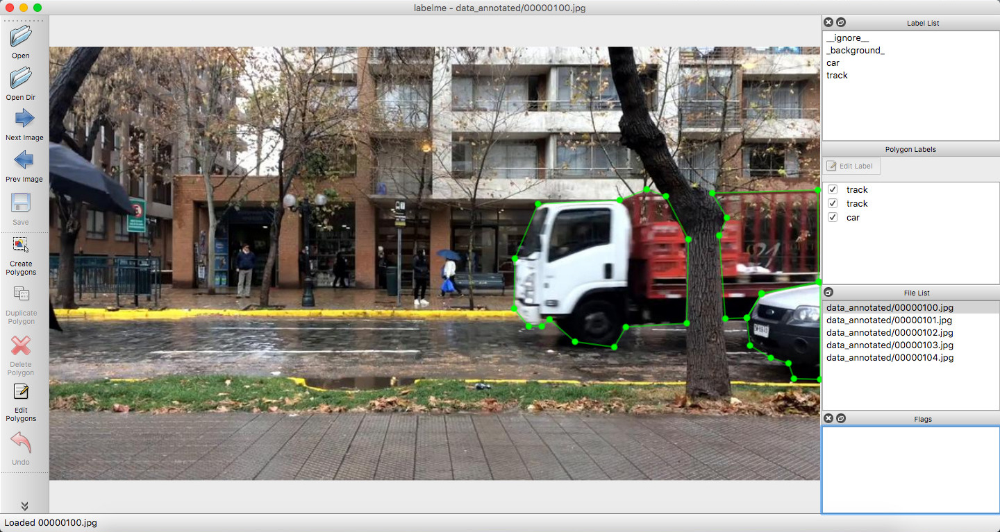
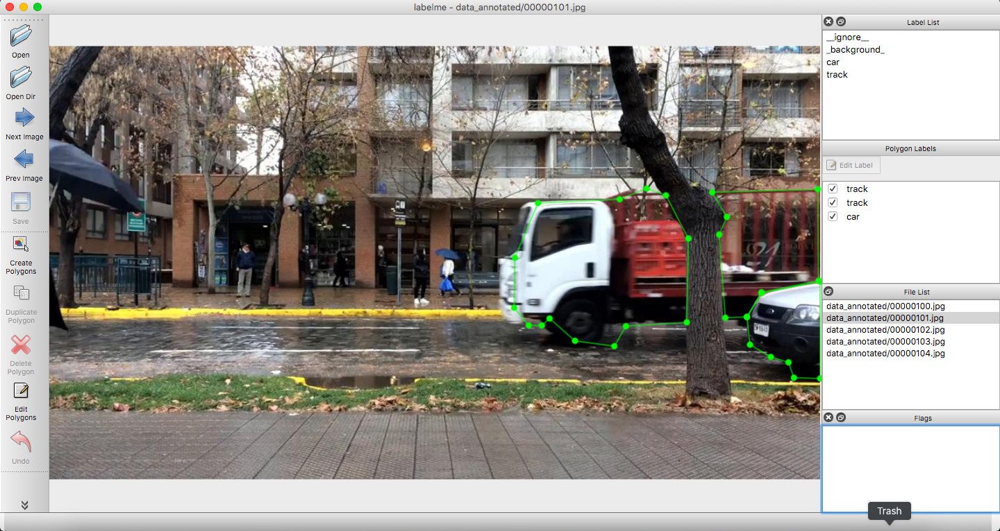
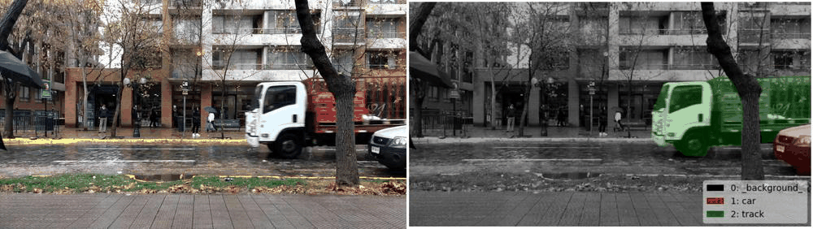

# Video Annotation Example


## Annotation

```bash
labelme data_annotated --labels labels.txt --nodata --keep-prev
```

 

*Fig 1. Video annotation example. A frame (left), The next frame (right).*




*Fig 2. Visualization of video semantic segmentation.*


## How to Convert a Video File to Images for Annotation?

```bash
# Download and install software for converting a video file (MP4) to images
wget https://raw.githubusercontent.com/wkentaro/dotfiles/f3c5ad1f47834818d4f123c36ed59a5943709518/local/bin/video_to_images
pip install imageio imageio-ffmpeg tqdm

python video_to_images your_video.mp4  # this creates your_video/ directory
ls your_video/

labelme your_video/
```
